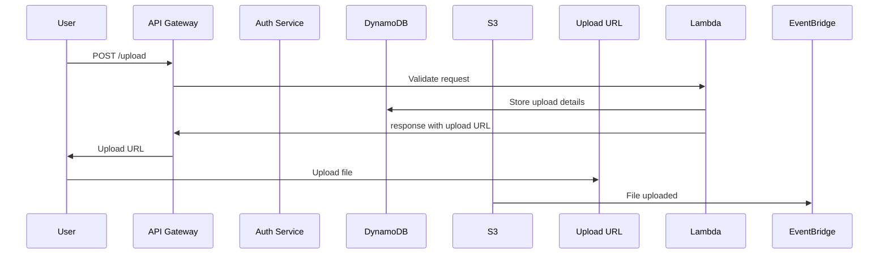

# Client File Uploader

This is an example of a solution of allowing client to upload files using AWS.

## How It Works

This application allows clients to upload files via presigned urls. To do so they need to have a have a client id and secret setup.

Once they have this a client can make a POST request to the `/uploads` endpoint. This endpoint will then validate the request and store information in DynamoDB and a presigned url will be returned. The client can then upload the file to the presigned url.

Once the file is uploaded to S3 an event will be sent to EventBridge and to a lambda function which has an S3 bucket configured as the event source.
